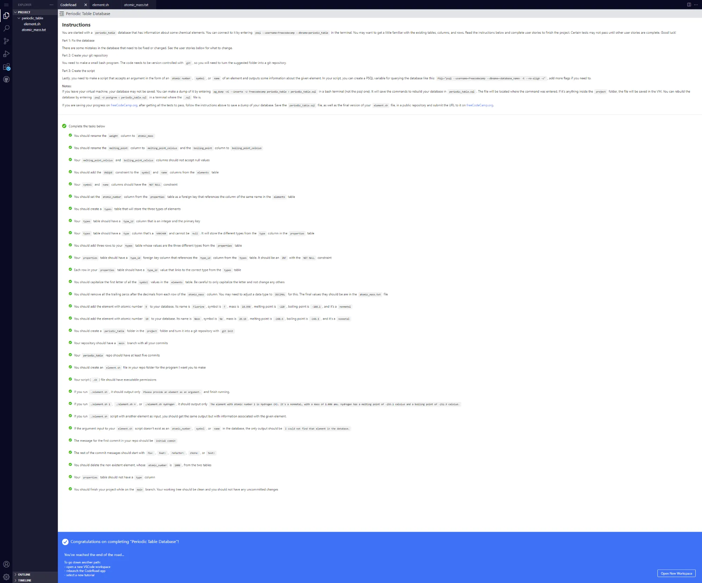

# Build a Periodic Table Database

Repositorio con los archivos necesarios para aprobar el [proyecto requisito obligatorio número 4](https://www.freecodecamp.org/learn/relational-database/build-a-periodic-table-database-project/build-a-periodic-table-database). Proyecto para obtener la [Relational Database Certification](https://www.freecodecamp.org/learn/relational-database/) de freecodecamp

## Tabla de Contenidos

## Instrucciones y All tests passed



## Script

```bash
#!/bin/bash

PSQL="psql --username=freecodecamp --dbname=periodic_table -t --no-align -c"

NOT_FOUND() {
    echo "I could not find that element in the database."
}

SHOW_DATA() {
    # $1 para tipo de consulta y $2 para el dato a buscar
    case "$1" in

    "atomic_number")
        RESULT=$($PSQL "SELECT atomic_number,name,symbol,type,atomic_mass,melting_point_celsius,boiling_point_celsius FROM elements INNER JOIN properties USING(atomic_number) INNER JOIN types USING(type_id) WHERE atomic_number=$2 ORDER BY atomic_number;")
        ;;
    "symbol")
        RESULT=$($PSQL "SELECT atomic_number,name,symbol,type,atomic_mass,melting_point_celsius,boiling_point_celsius FROM elements INNER JOIN properties USING(atomic_number) INNER JOIN types USING(type_id) WHERE UPPER(symbol)=UPPER('$2') ORDER BY atomic_number;")
        ;;
    "name")
        RESULT=$($PSQL "SELECT atomic_number,name,symbol,type,atomic_mass,melting_point_celsius,boiling_point_celsius FROM elements INNER JOIN properties USING(atomic_number) INNER JOIN types USING(type_id) WHERE UPPER(name)=UPPER('$2') ORDER BY atomic_number;")
        ;;
    esac

    if [[ -z $RESULT ]]; then
        NOT_FOUND
    else
        echo "$RESULT" | while IFS="|" read ATOMIC_NUMBER NAME SYMBOL TYPE ATOMIC_MASS MELTING_POINT_CELSIUS BOILING_POINT_CELSIUS; do
            echo "The element with atomic number $ATOMIC_NUMBER is $NAME ($SYMBOL). It's a $TYPE, with a mass of $ATOMIC_MASS amu. $NAME has a melting point of $MELTING_POINT_CELSIUS celsius and a boiling point of $BOILING_POINT_CELSIUS celsius."
        done
    fi
}

RUN() {

    if [[ -z $1 ]]; then
        echo "Please provide an element as an argument."
    else
        if [[ $1 =~ ^[0-9]+$ ]]; then
            SHOW_DATA "atomic_number" $1
        else
            # search on symbol
            if [[ $(echo "$1" | tr '[:lower:]' '[:upper:]') =~ ^[A-Z]{1,2}$ ]]; then
                SHOW_DATA "symbol" $1
            else
                # search on name
                SHOW_DATA "name" $1
            fi
        fi
    fi
}
RUN $1

```
